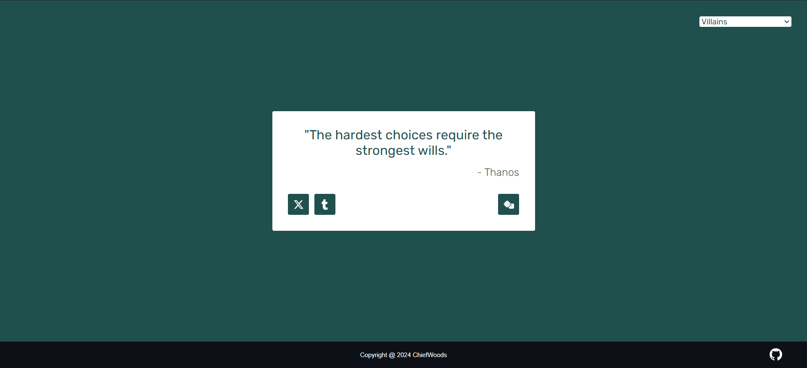

# Random Quote Machine



Quote generator for Front End Development Libraries in [freeCodeCamp](https://www.freecodecamp.org/learn/).

[Source Repository](https://github.com/ChiefWoods/random-quote-machine)

## Features

- Generate profound quotes spoken by villains
- Share quotes with quick social links

## Built With

### Languages

- [](https://html5.org/)
- [](https://www.w3.org/Style/CSS/Overview.en.html)
- [](https://js.org/index.html)
- [](https://svelte.dev/)
- [](https://www.typescriptlang.org/)


### Frameworks, Packages, Runtime and Bundlers

- [](https://expressjs.com/)
- [](https://www.dotenv.org/)
- [](https://mongoosejs.com/)
- [](https://nodejs.org/en)
- [](https://vitejs.dev/)

### Tools

- [](https://code.visualstudio.com/)
- [](https://www.mongodb.com/)

## Getting Started

### Prerequisites

Update your npm package to the latest version.
```
npm install npm@latest -g
```

### Setup

1. Clone the repository
```
git clone https://github.com/ChiefWoods/random-quote-machine.git
```
2. Install all dependencies
```
npm install
```
3. Start Node.js server
```
node server/apiHandler.js
```
4. In another terminal, start development server
```
npm run dev
```

## Issues

View the [open issues](https://github.com/ChiefWoods/random-quote-machine/issues) for a full list of proposed features and known bugs.

## Acknowledgements

### Resources

- [Shields.io](https://shields.io/)
- [Google Fonts](https://fonts.google.com/)
- [Pictogrammers](https://pictogrammers.com/)
- [Font Awesome](https://fontawesome.com/icons)

## Contact

[chii.yuen@hotmail.com](mailto:chii.yuen@hotmail.com)